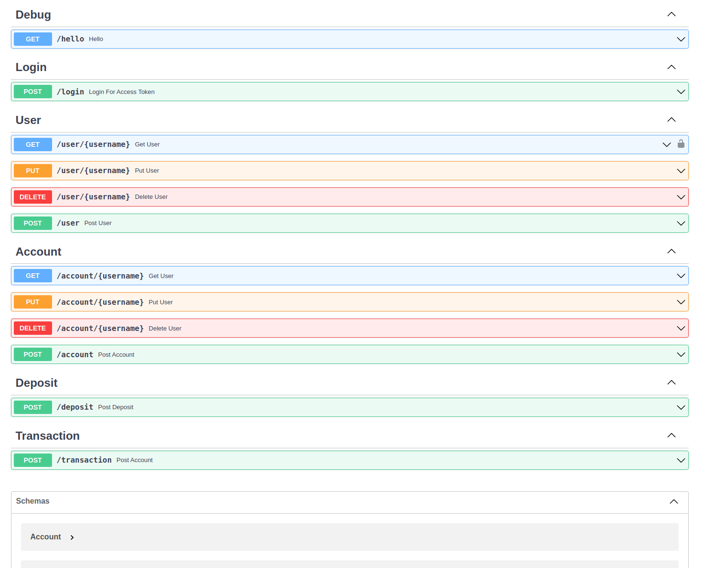

# GojengaApi

## Utilizing fastApi to power Gojenga

<b>Run locally to access</b>

[Live Swagger Interface](http://127.0.0.1:8000/docs#/)

### Architecture

User Type

name: str

password: str | None = None

### Test Flag

Headers:

**Is-Test: True**

_____

*get user information* 
GET /user/{username}

*create user*
Post /user
body: { "name" : "USERNAME", "password" : "PASSWORD" }

*update user*
PUT /user/{username}
body: { "name" : "USERNAME", "password" : "PASSWORD" }

*delete user*
DELETE /user/{username}
